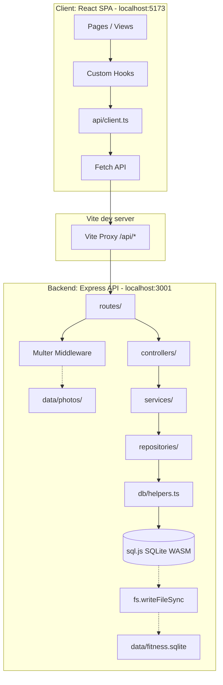
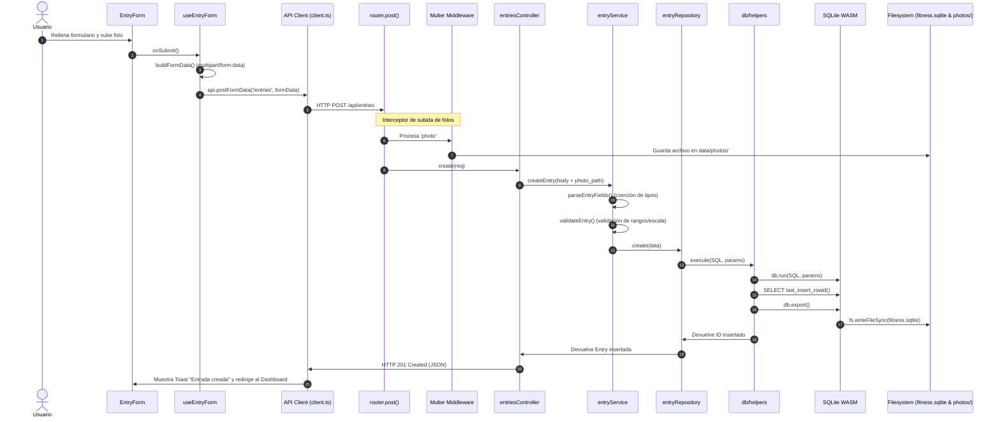

# Contexto de IA — Proyecto CambioFísico

Este documento proporciona una visión técnica integral y estructurada del proyecto **CambioFísico**. Está diseñado como fuente de contexto permanente para modelos de Inteligencia Artificial que deban analizar, mantener o extender esta aplicación.

---

## 1. Descripción general

### Propósito del proyecto
**CambioFísico** es una aplicación web local de seguimiento de recomposición corporal y progreso físico planificada para un reto de **90 días**. El enfoque central del proyecto es la **privacidad absoluta**: todos los datos y archivos multimedia se almacenan localmente en el ordenador del usuario. No depende de servidores en la nube, ni requiere creación de cuentas de usuario.

### Alcance y limitaciones
*   **Monousuario local:** El backend corre en `localhost` y persiste la información directamente en el disco.
*   **Offline-first:** Funciona al 100% sin conexión a internet.
*   **Sin autenticación:** Al ser una herramienta puramente local ejecutada en un entorno de desarrollo controlado, carece de capas de login, sesiones o autorización.

### Funcionalidades principales
*   **Registro diario detallado:** Permite almacenar peso (kg), sueño (horas y calidad de 1 a 5), bienestar subjetivo (hinchazón abdominal, energía, hambre y estado de ánimo, escala 1 a 5), tipo de entrenamiento (con autocompletado y catálogo dinámico), duración de la actividad física, realización de cardio (sí/no), notas generales y fotos de progreso.
*   **Nutrición segmentada:** Registro estructurado por comidas independientes: Desayuno, Almuerzo, Cena y Otros / Snacks.
*   **Recetario integrado (Markdown):** Permite escribir, visualizar y editar recetas locales formateadas en Markdown, así como importar ficheros `.md` externos.
*   **Hashtags interactivos:** Al describir comidas en la entrada del día, escribir `#` activa un autocompletado inteligente con sugerencias de recetas de la base de datos e historial de uso. En la vista de lectura, los hashtags válidos se transforman automáticamente en enlaces cliqueables hacia la receta correspondiente.
*   **Dashboard estadístico:** Panel visual con tarjetas de métricas (peso inicial/actual, racha de días, entrenamientos totales, medias de descanso), un ranking **Top 5** con la frecuencia de platos más consumidos, y gráficos dinámicos de evolución temporal de peso, sueño y bienestar.
*   **Exportación y Backups:** Mecanismos sencillos para exportar todos los registros a CSV (con compatibilidad de codificación para Excel) y a JSON, además de backups locales mediante copias de seguridad de carpetas físicas.

---

## 2. Arquitectura

El sistema está estructurado bajo un patrón de **arquitectura cliente-servidor local de doble proceso**:

```
┌─────────────────────────────────────────────────────────────┐
│  Navegador (localhost:5173)                                  │
│  ┌─────────────────────────────────────────────────────┐    │
│  │  React + TypeScript + Tailwind CSS                  │    │
│  │  (Vite dev server)                                  │    │
│  └─────────────────┬───────────────────────────────────┘    │
│                    │ fetch /api/* (proxy Vite)               │
│  └─────────────────┼────────────────────────────────────────┘
│                    │
┌────────────────────▼────────────────────────────────────────┐
│  Node.js + Express (localhost:3001)                          │
│  ┌────────────────────────────────────────────────────┐     │
│  │  Routes → Controllers → Services → Repositories    │     │
│  └────────────────────┬───────────────────────────────┘     │
│                        │                                     │
│  ┌─────────────────────▼──────────────┐                     │
│  │  SQLite (sql.js / WASM)            │                     │
│  │  ../data/fitness.sqlite            │                     │
│  └────────────────────────────────────┘                     │
│  ┌────────────────────────────────────┐                     │
│  │  Fotos: ../data/photos/            │                     │
│  └────────────────────────────────────┘                     │
└─────────────────────────────────────────────────────────────┘
```

### Capas del backend (Arquitectura en capas limpia)
El backend está programado bajo un flujo unidireccional estricto con responsabilidades bien delimitadas:

1.  **Rutas (`routes/`):** Define los puntos de entrada de la API REST y asocia middlewares (como Multer para subida de ficheros).
2.  **Controladores (`controllers/`):** Capa adaptadora HTTP. Lee parámetros de la petición (`Request`), llama a los servicios correspondientes y gestiona la respuesta (`Response`) y errores (`next(err)`).
3.  **Servicios (`services/`):** Capa de lógica de negocio y orquestación. Convierte los datos que viajan como strings en peticiones multipart a tipos nativos (coerción), coordina la persistencia en disco, gestiona ficheros de fotos antiguos al ser reemplazados y ejecuta validadores.
4.  **Repositorios (`repositories/`):** Capa de acceso a datos pura. Contiene las consultas SQL preparadas. Desconoce por completo los detalles de Express o HTTP.
5.  **Ayudantes de Base de Datos (`db/helpers.ts`):** Abstracciones genéricas para `sql.js` (`queryAll`, `queryOne`, `execute`). Encapsula la persistencia sincronizada en disco físico tras operaciones de escritura.
6.  **Base de datos (`db/database.ts`):** Instancia única (Singleton) de SQLite cargada en memoria mediante WebAssembly (`sql.js`).



---

## 3. Tecnologías

El stack técnico detectado en la aplicación y sus versiones concretas son:

### Tecnologías Core
| Tecnología | Versión | Ámbito | Propósito |
|---|---|---|---|
| **TypeScript** | `5.4.2` (Back) / `5.2.2` (Front) | General | Tipado estático y robustez del desarrollo |
| **Node.js** | `>= 18.0.0` (v22.16.0 probado) | Runtime | Servidor de ejecución del backend |
| **React** | `18.2.0` | Frontend | Biblioteca UI basada en componentes |
| **Express** | `4.18.3` | Backend | Framework web para la API REST |
| **sql.js** | `1.11.0` | Base de datos | SQLite compilado a WebAssembly (sin dependencias nativas) |
| **Vite** | `5.2.0` | Build tool | Servidor de desarrollo HMR y compilación rápida |
| **Tailwind CSS** | `3.4.3` | Estilos | Framework CSS de utilidades |

### Librerías del backend importantes
*   **`multer`** (`^1.4.5-lts.1`): Gestión de carga de fotos mediante peticiones `multipart/form-data`.
*   **`uuid`** (`^9.0.1`): Generación de hashes únicos para evitar colisión de nombres en fotos.
*   **`cors`** (`^2.8.5`): Habilitación de CORS para peticiones entre diferentes puertos en desarrollo.
*   **`tsx`** (`^4.7.1`): Ejecución directa de ficheros TypeScript en caliente (modo watch).

### Librerías del frontend importantes
*   **`react-router-dom`** (`^6.22.3`): Gestión de rutas en el cliente utilizando Hash Routing.
*   **`recharts`** (`^2.12.3`): Renderizado de gráficos interactivos (peso, horas de sueño, escalas).
*   **`react-markdown`** (`^10.1.0`) y **`remark-gfm`** (`^4.0.1`): Soporte y visualización del recetario en Markdown con formato ampliado de GitHub.
*   **Iconos Locales SVG:** Sistema propio de carga e inyección en React (`src/components/icons/Icon.tsx`) utilizando imports estáticos con query `?raw` para evitar dependencias en tiempo de ejecución.

---

## 4. Estructura del proyecto

Explicación detallada del árbol de directorios principal:

```
CambioFisico/
├── data/                             # Directorio autogenerado de almacenamiento físico
│   ├── fitness.sqlite                # Base de datos SQLite (WASM persistida)
│   └── photos/                       # Archivos de imágenes de progreso (.jpg, .png, .webp)
│
├── docs/                             # Documentación en Markdown
│   ├── API.md                        # Referencia de endpoints HTTP
│   ├── ARQUITECTURA.md               # Detalle de capas y patrones de diseño
│   ├── DESARROLLO.md                 # Guía para el desarrollador
│   ├── MODELOS.md                    # Esquema SQL y tipos
│   └── TECNOLOGIAS.md                # Stack técnico y sistema de iconos
│
├── backend/                          # Backend Node.js
│   ├── server.ts                     # Punto de entrada (inicialización y arranque en puerto 3001)
│   ├── src/
│   │   ├── app.ts                    # Inicialización de middlewares Express y enrutadores
│   │   ├── config.ts                 # Constantes de puertos y rutas físicas
│   │   ├── multerConfig.ts           # Configuración de límites y filtros de subida de Multer
│   │   ├── db/                       # Inicializador, schema y helpers SQL de sql.js
│   │   ├── repositories/             # CRUD puro contra SQLite (SQL directo)
│   │   ├── services/                 # Reglas de negocio y procesamiento
│   │   ├── controllers/              # Adaptación de endpoints y HTTP responses
│   │   ├── routes/                   # Enrutamiento de recursos de la API
│   │   ├── validators/               # Validaciones de negocio (peso, fecha, calidad)
│   │   ├── types/                    # DTOs y tipos del backend
│   │   └── middleware/               # Middleware global de control de errores
│   └── tsconfig.json                 # Configuración de compilación TS del backend
│
└── frontend/                         # Frontend React
    ├── vite.config.ts                # Configuración de Vite y proxy /api -> localhost:3001
    ├── tailwind.config.js            # Configuración de clases y paleta de Tailwind
    ├── index.html                    # HTML base con tipografía Inter y metas SEO
    ├── src/
    │   ├── main.tsx                  # Entrada de la SPA React
    │   ├── App.tsx                   # Declaración de rutas, layout y ToastProvider
    │   ├── index.css                 # Fichero de estilos globales, diseño atómico y componentes
    │   ├── api/                      # Envoltura de fetch tipada (client.ts)
    │   ├── types/                    # Espejos de tipos del backend y constantes de retos
    │   ├── utils/                    # Computación matemática de stats y formateadores puros
    │   ├── hooks/                    # Lógica de datos (useEntries, useCustomOptions, etc.)
    │   ├── contexts/                 # Contextos de React (notificaciones Toast)
    │   ├── components/               # Elementos visuales reutilizables
    │   │   ├── ui/                   # Modales, spinner de carga, ratings, comboboxes, FAB
    │   │   ├── layout/               # Barra lateral de navegación y estructura base de la app
    │   │   ├── dashboard/            # Tarjetas de estadísticas y evolución de gráficas
    │   │   ├── entries/              # Secciones del formulario de días e historial
    │   │   └── recipes/              # Editores, visualizadores e inputs de hashtags
    │   └── pages/                    # Vistas principales de las rutas
    └── tsconfig.json                 # Configuración del compilador TS de React
```

---

## 5. Flujo de funcionamiento

### A. Registro diario con subida de imagen
El siguiente diagrama detalla la secuencia completa desde que el usuario confirma el formulario hasta que el sistema escribe los datos físicos en disco:



### B. Registro y sugerencias de nutrición (Hashtags)
1.  **Edición:** Al escribir `#` en un input (`MealHashtagInput.tsx`), se filtra el texto usando el estado combinado de recetas (del backend) y de hashtags libres guardados previamente en el historial de entradas (`useEntries`).
2.  **Highlight en escritura:** El input es un `textarea` invisible superpuesto a un `div` clonado. Un parser procesa los hashtags identificados por Regex (`/#[a-z0-9-ñáéíóúü]+/gi`):
    *   Si coincide con una receta persistida, se muestra con fondo verde esmeralda.
    *   Si es libre (historial), se dibuja con fondo gris pizarra.
    *   Los guiones se ocultan con caracteres transparentes en la previsualización del overlay para mejorar la lectura conservando el ancho de cara a evitar desfases con el cursor.
3.  **Visualización (Lectura):** Al cargar las entradas en las tablas o vistas de detalle, el componente `MealText` procesa los strings. Reemplaza guiones por espacios reales y renderiza badges grises para términos comunes y verdes hipervinculados a `/recetas/:id` para recetas reales.

---

## 6. Componentes importantes

### Backend
*   **`backend/src/db/database.ts`**: Inicializa directorios locales de forma síncrona si no existen (`data` y `data/photos`). Gestiona la carga inicial de `sql.js` localizando el archivo `.wasm` en `node_modules` y expone la base de datos única.
*   **`backend/src/db/schema.ts`**: Contiene la definición del esquema DDL. Realiza la comprobación de migración segura mediante `addColumnSafe` para asegurar compatibilidad al añadir columnas adicionales (`meal_*` fields, etc.) a archivos `.sqlite` ya creados previamente por el usuario.
*   **`backend/src/services/entryService.ts`**: Encapsula el casteo e interpretación de tipos HTTP (ya que `multipart` transmite todo como strings). Se encarga de eliminar fotos en disco viejo cuando el usuario edita una entrada y adjunta otra nueva.
*   **`backend/src/multerConfig.ts`**: Limita el tamaño de fotos a 10 MB y valida extensiones permitidas (`.jpg`, `.jpeg`, `.png`, `.webp`). Asigna nombres de fichero según patrón `${date}-progreso-${shortId}${ext}`.

### Frontend
*   **`frontend/src/components/recipes/MealHashtagInput.tsx`**: Componente crítico. Utiliza superposición de capas (textarea transparente + div overlay con márgenes e inline spacing recalculados) y funciones de cálculo de posición de cursor (`getCaretCoordinates`) para ofrecer autocompletado flotante y renderizado enriquecido de tags.
*   **`frontend/src/components/icons/Icon.tsx`**: Punto centralizado de inyección de iconos SVG locales. Mapea identificadores mediante imports estáticos con query `?raw` de Vite para inyectar paths SVG directamente y permitir aplicarles clases dinámicas de Tailwind (cambiar colores, tamaños y bordes).
*   **`frontend/src/utils/statsComputer.ts`**: Algoritmo para calcular la racha activa de días consecutivos computada a partir de la fecha actual de la máquina hacia atrás en un conjunto de fechas. Computa además medias de sueño, entrenamientos y diferencias respecto a la constante `INITIAL_WEIGHT`.
*   **`frontend/src/hooks/useCustomOptions.ts`**: Hook para añadir y recuperar de `localStorage` sugerencias personalizadas de tipos de entrenamientos añadidas por el usuario (ej. "Padel"). Combina las fijas con las dinámicas y las persiste bajo la clave `cambiofisico_opts_<key>`.

---

## 7. Modelos de datos

### Base de datos SQLite

#### Tabla: `entries`
Contiene el registro diario del usuario.
```sql
CREATE TABLE IF NOT EXISTS entries (
  id               INTEGER PRIMARY KEY AUTOINCREMENT,
  date             TEXT    UNIQUE NOT NULL, -- Fecha en formato YYYY-MM-DD
  weight           REAL,                    -- Peso corporal en kg
  sleep_hours      REAL,                    -- Horas de sueño
  sleep_quality    INTEGER,                 -- Calidad de descanso (1–5)
  steps            INTEGER,                 -- [Deprecado e Invisible en UI]
  workout_type     TEXT,                    -- Categoría o disciplina del entrenamiento
  workout_duration INTEGER,                 -- Minutos dedicados al ejercicio
  cardio_done      INTEGER DEFAULT 0,       -- Booleano SQLite (0 o 1)
  food_description TEXT,                    -- [Deprecado e Invisible en UI]
  carbs_amount     REAL,                    -- [Deprecado e Invisible en UI]
  water_liters     REAL,                    -- [Deprecado e Invisible en UI]
  meal_breakfast   TEXT,                    -- Desayuno registrado
  meal_lunch       TEXT,                    -- Almuerzo registrado
  meal_dinner      TEXT,                    -- Cena registrada
  meal_other       TEXT,                    -- Meriendas / otros registrados
  bloating         INTEGER,                 -- Nivel de hinchazón abdominal (1–5)
  energy           INTEGER,                 -- Nivel de energía (1–5)
  hunger           INTEGER,                 -- Sensación de hambre (1–5)
  mood             INTEGER,                 -- Estado de ánimo (1–5)
  notes            TEXT,                    -- Notas y observaciones libres
  photo_path       TEXT,                    -- Nombre del fichero de imagen asociado
  created_at       TEXT DEFAULT CURRENT_TIMESTAMP,
  updated_at       TEXT DEFAULT CURRENT_TIMESTAMP
);
```

#### Tabla: `recipes`
Contiene las recetas Markdown.
```sql
CREATE TABLE IF NOT EXISTS recipes (
  id         INTEGER PRIMARY KEY AUTOINCREMENT,
  name       TEXT NOT NULL,
  slug       TEXT NOT NULL UNIQUE,            -- Clave única para los hashtags (ej: #risotto-de-pollo)
  content    TEXT NOT NULL DEFAULT '',        -- Cuerpo de la receta en formato Markdown
  tags       TEXT NOT NULL DEFAULT '',        -- Etiquetas separadas por comas (ej: "pollo, arroz, almuerzo")
  created_at TEXT DEFAULT CURRENT_TIMESTAMP,
  updated_at TEXT DEFAULT CURRENT_TIMESTAMP
);
```

### Tipos TypeScript (`frontend/src/types/entry.ts`)
*   `Entry`: Mapeo directo 1:1 de los campos de la tabla `entries`.
*   `EntryFormData`: Representa `Omit<Entry, 'id' | 'created_at' | 'updated_at'>`.
*   `WorkoutType`: Tipado de entrenamiento por unión de cadena extraído de la constante `WORKOUT_TYPES`.

---

## 8. API

Todos los endpoints locales del backend corren por defecto en `http://localhost:3001` y devuelven respuestas en formato JSON (salvo descargas estáticas).

### Rutas de la API

| Método | Endpoint | Cabeceras requeridas | Tipo de Payload | Descripción |
|---|---|---|---|---|
| **GET** | `/api/entries` | Ninguna | Ninguno | Obtener todas las entradas cronológicas inversas |
| **GET** | `/api/entries/:id` | Ninguna | Ninguno | Obtener detalle de una entrada por ID |
| **POST** | `/api/entries` | `multipart/form-data` | `FormData` | Crear entrada física. Soporta archivo `photo` opcional |
| **PUT** | `/api/entries/:id` | `multipart/form-data` | `FormData` | Actualizar entrada. Gestiona y sustituye fotos |
| **DELETE**| `/api/entries/:id` | Ninguna | Ninguno | Eliminar entrada física y borrar foto en disco si existe |
| **GET** | `/api/recipes` | Ninguna | Ninguno | Obtener todas las recetas. Filtro de búsqueda opcional `?q=` |
| **GET** | `/api/recipes/:id` | Ninguna | Ninguno | Detalle de una receta por ID |
| **POST** | `/api/recipes` | `application/json` | `JSON` | Crear receta con `name`, `slug`, `content` y `tags` |
| **PUT** | `/api/recipes/:id` | `application/json` | `JSON` | Modificar datos o cuerpo Markdown de receta por ID |
| **DELETE**| `/api/recipes/:id` | Ninguna | Ninguno | Eliminar receta de la base de datos |
| **GET** | `/api/photos/:filename` | Ninguna | Ninguno | Servir estáticamente el recurso de imagen asociado |
| **POST** | `/api/uploads/photo` | `multipart/form-data` | `FormData` | Subida de foto huérfana. Devuelve el `{ filename }` generado |
| **GET** | `/api/export/csv` | Ninguna | Ninguno | Genera y descarga un CSV del histórico con UTF-8 BOM |
| **GET** | `/api/export/json` | Ninguna | Ninguno | Genera y descarga backup JSON completo del histórico |

---

## 9. Estado actual

### Funcionalidades Completas
*   Conexión e inicialización robusta del motor SQLite WASM (`sql.js`).
*   Registro y edición de entradas con fotos, con limpieza automática de imágenes antiguas huérfanas en el disco físico del servidor.
*   Editor e importador de recetas en Markdown, con previsualizador integrado de código GFM (tablas, negritas, listas).
*   Visualización interactiva de hashtags. Renderizado dinámico de enlaces cliqueables a recetas asociadas o badges de historial de forma unificada.
*   Cálculo correcto de estadísticas de evolución física en el Dashboard (peso inicial/actual, racha de días, entrenamientos totales) excluyendo pasos del flujo visual principal.
*   Autocompletado de comida e histórico combinando registros persistidos en base de datos.
*   Notificaciones de Toasts globales interactivas y diálogos modales accesibles para confirmaciones de borrado destructivas.

### Funcionalidades Parcialmente Implementadas / Incompletas
*   **Exportador CSV desactualizado:** El endpoint `/api/export/csv` (gestionado por `backend/src/services/exportService.ts`) no incluye las columnas de las nuevas comidas segmentadas (`meal_breakfast`, `meal_lunch`, `meal_dinner`, `meal_other`). En su lugar, sigue exportando las columnas deprecadas que ya no se muestran en el cliente (`food_description`, `carbs_amount`, `water_liters`, `steps`).
*   **Ausencia de Tests Automatizados:** No hay ficheros de tests (`Jest`, `Vitest`, etc.). Toda la validación actual se realiza manualmente y mediante análisis estático de tipos (`tsc`).

### Comentarios y TODOs eliminados del código de producción
*   Las directivas antiguas de steps y parámetros antiguos fueron deprecadas formalmente en los modelos y tipos (`@deprecated Use meal_* fields`).
*   No existen comentarios `TODO` o `FIXME` de bloqueo técnico en el código de `/src` activo de frontend o backend.

---

## 10. Convenciones del proyecto

Cualquier IA o desarrollador que trabaje en esta base de código debe ceñirse a las siguientes normas:

### Estilo de Código e Idioma
*   **Idioma:** Comentarios, interfaces, esquemas y campos lógicos de base de datos están escritos en **inglés**. La interfaz de usuario mostrada en el navegador, textos explicativos y mensajes Toast están redactados en **español**.
*   **TypeScript:** Tipado explícito obligatorio. Evitar el uso de `any`. Las props de componentes y DTOs de comunicación deben declararse estrictamente.
*   **CSS:** Uso exclusivo de Tailwind CSS a través de sus clases de utilidad o directivas `@apply` ubicadas exclusivamente en `frontend/src/index.css`. No introducir inline CSS en los componentes React (`style={{...}}`) a menos que sea para posiciones calculadas dinámicamente en tiempo de ejecución.

### Convenciones de Nomenclatura
*   **Archivos y Carpetas:** Kebab-case en rutas generales y nombres de archivos de iconos (ej: `my-icon-name.svg`).
*   **Componentes React:** PascalCase (ej: `MealHashtagInput.tsx`).
*   **Servicios, Repositorios y Utilidades:** camelCase (ej: `entryRepository.ts`, `statsComputer.ts`).
*   **Claves de almacenamiento local (LocalStorage):** Uso del prefijo `cambiofisico_opts_` para evitar colisiones con otras aplicaciones corriendo localmente bajo el mismo dominio de pruebas `localhost`.

### Patrón de flujo de cambios
Cuando se añada una funcionalidad o lógica al backend, se debe respetar el sentido estricto del patrón arquitectónico:
`Route -> Controller -> Service (coerciones y validaciones) -> Repository (sentencias SQL preparadas) -> db/helpers`.
Nunca llames a comandos de base de datos ni ejecutes consultas SQL directamente en los controladores o en los servicios.

---

## 11. Dependencias importantes

*   **`sql.js` (SQLite WASM):** Es la dependencia de base de datos elegida en lugar de alternativas nativas (como `better-sqlite3`). Esto evita que el usuario tenga que disponer de Visual Studio Build Tools, compiladores de C++ o dependencias de `node-gyp` instaladas localmente en Windows. Funciona de manera síncrona cargando el buffer del fichero `.sqlite` en memoria, exportando y sobreescribiendo el fichero en disco mediante Node `fs` ante cada cambio.
*   **`tsx` (TypeScript Execute):** Utilizado en los entornos locales de desarrollo para ejecutar directamente ficheros TS sin necesidad de generar carpetas `/dist` intermedias en cada recarga de cambios, acelerando drásticamente el desarrollo backend.
*   **`react-markdown` & `remark-gfm`**: Críticos para el renderizado del recetario local, encargándose del parseo correcto del Markdown subido o redactado por el usuario.

---

## 12. Configuración

### Puertos por defecto
*   **Frontend (Vite):** `http://localhost:5173`
*   **Backend (Express):** `http://localhost:3001` (Modificable mediante la variable de entorno `PORT`).

### Ficheros de Configuración Críticos
*   **`frontend/vite.config.ts`**: Contiene la definición del proxy API de desarrollo:
    ```typescript
    proxy: {
      '/api': {
        target: 'http://localhost:3001',
        changeOrigin: true,
      }
    }
    ```
*   **`backend/src/config.ts`**: Centraliza los paths de persistencia física:
    ```typescript
    export const DATA_DIR = path.resolve(process.cwd(), '../data');
    export const DB_PATH = path.join(DATA_DIR, 'fitness.sqlite');
    export const PHOTOS_DIR = path.join(DATA_DIR, 'photos');
    ```

### Comandos útiles de terminal
*   **Ejecutar Servidor de API (Backend):**
    ```bash
    cd backend && npm run dev
    ```
*   **Ejecutar Interfaz (Frontend):**
    ```bash
    cd frontend && npm run dev
    ```
*   **Comprobar errores de tipado TypeScript (No Emit):**
    ```bash
    # En la carpeta /backend:
    npx tsc --noEmit
    # En la carpeta /frontend:
    npx tsc --noEmit
    ```

---

## 13. Riesgos técnicos

1.  **Deuda Técnica en Exportaciones (Desincronización de Esquema):**
    El fichero `backend/src/services/exportService.ts` está desactualizado respecto al esquema actual de la base de datos de entradas. Al descargar el CSV, se omiten las comidas detalladas por tramos del día (`meal_breakfast`, `meal_lunch`, etc.). Modificaciones o añadidos futuros de columnas en `schema.ts` requieren ser replicados de forma explícita en el mapeador `entryToCsvRow` para evitar pérdida de datos en las hojas de cálculo.
2.  **Rendimiento en Escritura (sql.js / Persistencia síncrona):**
    Dado que `sql.js` opera puramente en memoria, la función `persist()` exporta la base de datos completa como un array de bytes y sobreescribe síncronamente el fichero `fitness.sqlite` en disco tras cada consulta SQL modificativa (`INSERT`, `UPDATE`, `DELETE`). Aunque para ~90 días el tamaño es mínimo y el coste es despreciable, cargas masivas de datos o ejecuciones en bucle de sentencias de escritura podrían bloquear el hilo de ejecución (Event Loop) de Node.js.
3.  **Persistencia Volátil de Opciones de Autocompletado:**
    Los comboboxes recuerdan términos creados por el usuario mediante `localStorage`. Al ser un almacenamiento atado al origen del navegador, borrar los datos de navegación del explorador, cambiar de navegador o modificar el puerto/host local de Vite provocará la pérdida de estos términos personalizados.
4.  **Bloqueos Síncronos al Iniciar Servidor:**
    El método `ensureDirectories` y la lectura del fichero de base de datos en `initializeDatabase` se ejecutan síncronamente mediante `fs.existsSync` y `fs.readFileSync` al arrancar el servidor Express en `server.ts`.

---

## 14. Recomendaciones para futuras IA

Cualquier modelo de IA que trabaje sobre este repositorio debe seguir estos lineamientos específicos:

*   **No eludas las capas del backend:** Si vas a añadir una consulta a base de datos, agrégala en el repositorio. Llama al repositorio desde un servicio, y a su vez consume el servicio desde el controlador. Nunca inyectes código SQL ni validaciones de campos directamente en las rutas de Express.
*   **Actualiza el servicio de exportación:** Si introduces o modificas atributos en la tabla de entradas (`entries`) dentro de `backend/src/db/schema.ts`, debes actualizar obligatoriamente `backend/src/services/exportService.ts` para que se incorpore en las columnas del CSV exportado.
*   **Respeta el sistema local de iconos SVG:** No instales bibliotecas externas de iconos (ej: Lucide React de npm en producción o FontAwesome). Para añadir un icono:
    1.  Descarga el SVG oficial del icono en `frontend/src/assets/icons/` en minúsculas y kebab-case.
    2.  Importa el SVG con la query raw en `frontend/src/components/icons/Icon.tsx`:
        `import miIcono from '../../assets/icons/mi-icono.svg?raw';`
    3.  Añádelo al objeto estático `ICON_MAP`.
*   **Usa clases Tailwind del sistema:** No inventes colores CSS inline en el JSX. Utiliza la paleta esmeralda (`text-emerald-400`, `bg-emerald-500/10`), gris (`text-slate-300`, `bg-slate-900`) y animaciones ya configuradas en `tailwind.config.js`.
*   **Migraciones seguras:** Siempre que crees nuevas tablas o modifiques columnas existentes, utiliza la función helper `addColumnSafe` del fichero `schema.ts`. Esto previene fallos al ejecutar el servidor en ordenadores que ya posean un fichero `fitness.sqlite` previo creado por versiones anteriores.

---

## 15. Resumen ejecutivo

```
+-----------------------------------------------------------------------+
|                             CAMBIOFÍSICO                              |
|              Seguimiento local de recomposición a 90 días             |
+-----------------------------------------------------------------------+
| - PRIVACIDAD ABSOLUTA: Ejecución 100% en localhost sin nube.          |
| - ALMACENAMIENTO FISICO: /data/fitness.sqlite & /data/photos/         |
| - TECNOLOGÍAS CLAVE: React, Express, sql.js (SQLite WASM), Tailwind.  |
+-----------------------------------------------------------------------+
|  FRONTEND (Vite on :5173)              BACKEND (Express on :3001)     |
|  - Hash Routing SPA.                   - Arquitectura Limpia Multicapa|
|  - UI atómica + Tailwind.              - sql.js en memoria.           |
|  - Hashtags interactivos.              - Sincronización a disco.      |
|  - Gráficos con Recharts.              - Multer para fotos locales.   |
+-----------------------------------------------------------------------+
|  RIESGOS TÉCNICOS:                                                    |
|  - El exportador CSV no incluye las nuevas comidas segmentadas.       |
|  - La base de datos escribe síncronamente a disco ante cada insert.   |
|  - Las opciones custom de combobox se guardan en LocalStorage.        |
+-----------------------------------------------------------------------+
```

Este proyecto está diseñado para ser liviano, rápido y fácil de desplegar. El núcleo lógico depende de la consistencia de sus capas y de que la base de datos sea tratada como un recurso en memoria volcado al disco físico síncronamente. Cualquier cambio de diseño debe priorizar estas premisas de portabilidad extrema y almacenamiento 100% local.
